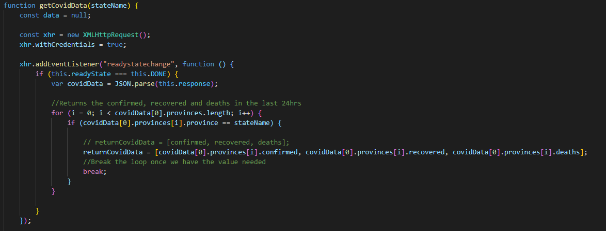

# Vaccinator

## Motivation

Being in the midst of a pandemic, we felt that it was only appropriate to orrient our project arround the one thing thats changed many peoples lives in the past year (Covid-19). With people now recieving the Covid-19 vaccine, we wanted to build a site where people can easily get information on how any given state (in the US) is handling vaccinating their people. 

## Summary

With this website, the user will be able to input a state, and recieve relevant vaccine information for that state. When user input is accepted, the website will display a graph showing how many people have been vaccinated in the state, a map of the United States to be able to quickly see the percentage of people vaccinated per state, a list of pharmacies that are administering the vaccine ( will only display if they currently available ), and a list of the vaccine information for the state(i.e. number of people that recieved first dose, number of people fully vaccinated, etc.).

## How To Use

Step 1. Enter the name of a state in the search bar. As you are entering the name, a dropdown menu will appear giving you the option to either click on the desired state, or complete typing the states name yourself.

Step 2. Click Search

## Built With

* [HTML]
* [CSS]
* [JavaScript]
* [Github]
* [Bulma]
* [Jquery/JqueryUI]
* [Chart.JS]
* [GoogleMapsAPI]
* [VaccineSpotterAPI]
* [Corona.LMAO]

## Code Snippet  

## Deployed Link

[See Live Site](https://manuelvrsr.github.io/GroupProject/)

## Authors

**Manuel** 

[Link to Github](https://github.com/manuelvrsr)

[Link to LinkedIn](https://www.linkedin.com/in/manuel-villasenor-854186205/)

**Dylan**

[Link to Github](https://github.com/Dylancouzon),

[Link to LinkedIn](https://www.linkedin.com/in/dcouzon/)

**Rosario**

[Link to Github](https://github.com/rtmiranda18)

[Link to LinkedIn](https://www.linkedin.com/in/rosario-miranda-b81170132/)

